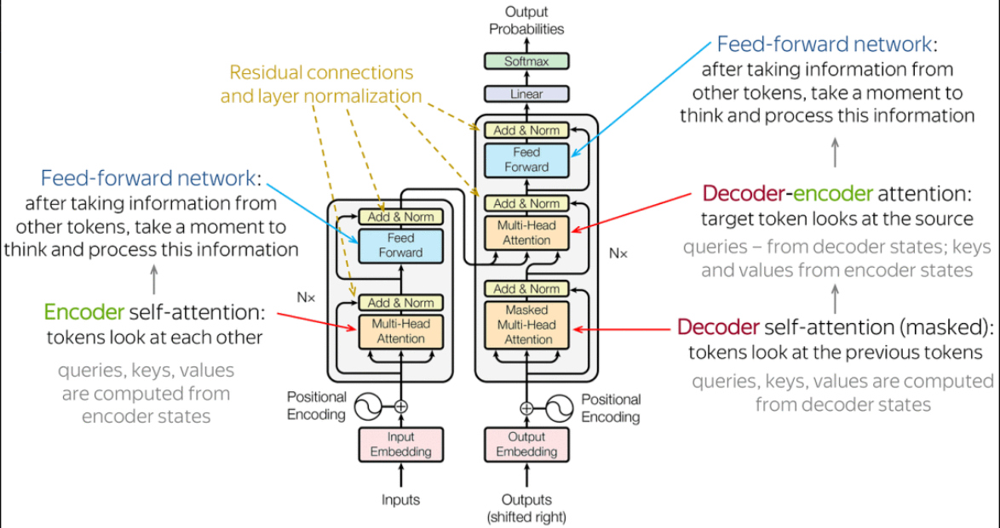
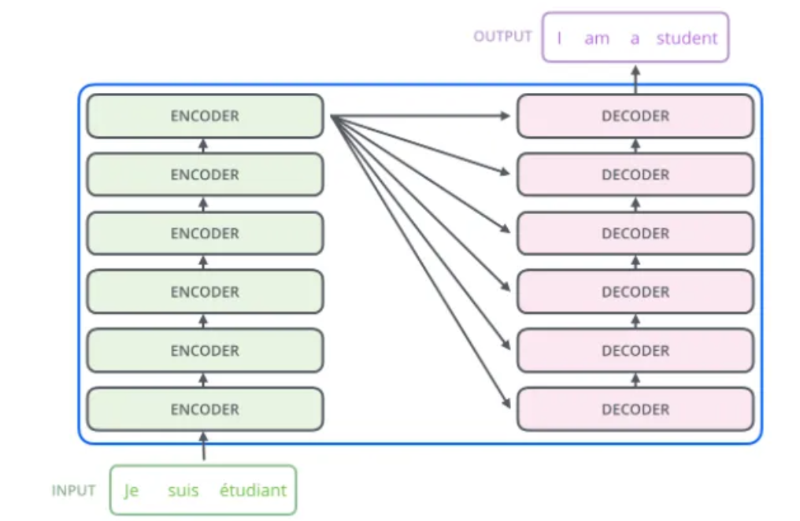
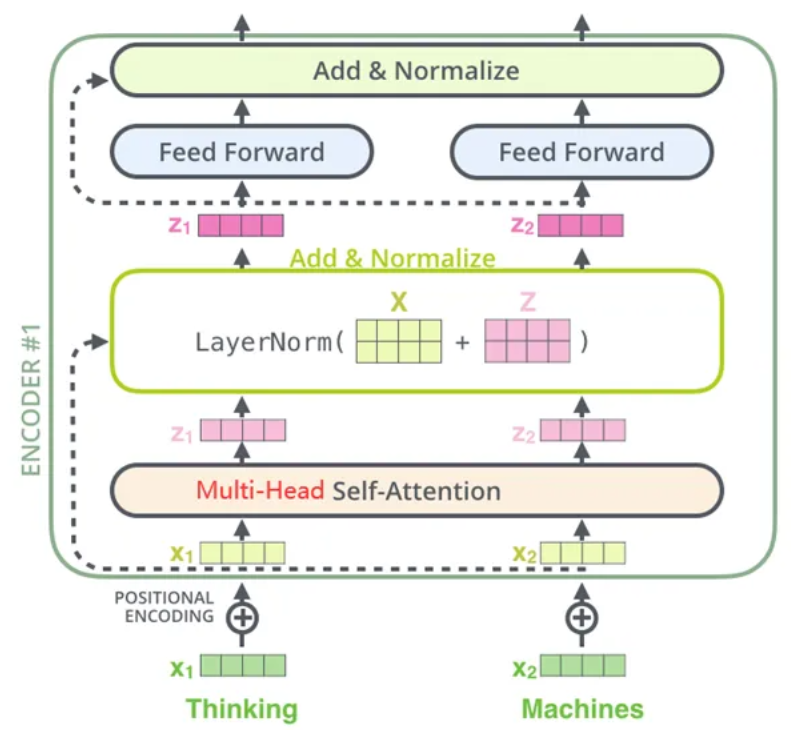
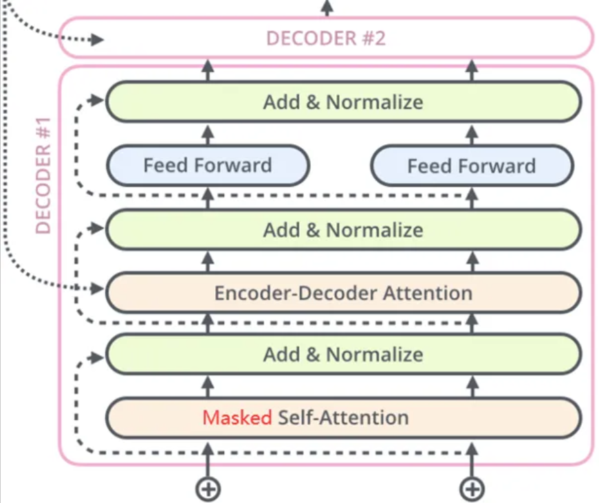
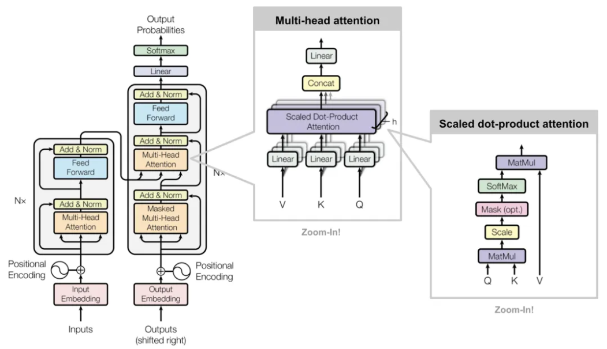
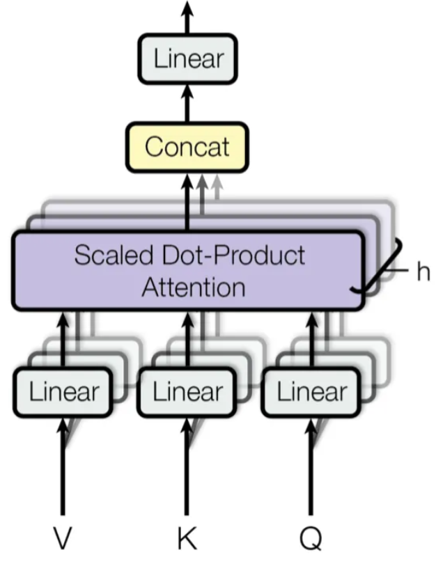
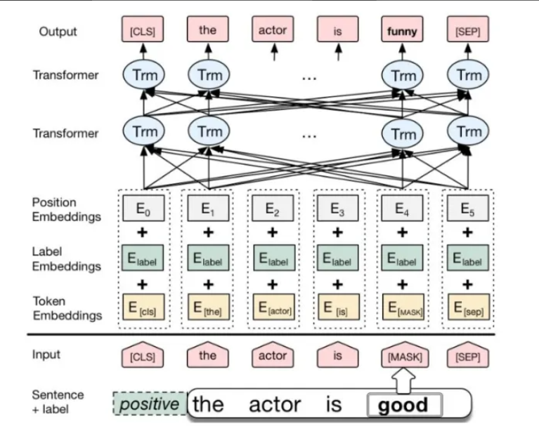
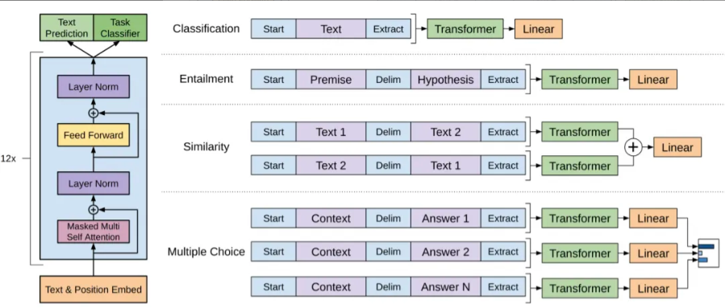

文章：[Attention Is All You Need](https://arxiv.org/abs/1706.03762)
视频：[B站：堂吉诃德拉曼查的英豪](https://www.bilibili.com/video/BV1zSDMBUE5o/?spm_id_from=333.1007.top_right_bar_window_history.content.click&vd_source=4d928eb79bcd61bc6c36121da23c338a)

---

# Transformer(注意力机制)

Transformer架构的提出奠定了大模型时代基础，使基于注意力机制的生成模型成为主流。

## Transformer架构
主要由**输入部分**（输入输出嵌入和位置编码）、**多层编码层**、**多层解码层**以及**输出部分**（输出线性层和Softmax）四大部分组成。

<u>Transformer详解</u>

Encoder - Decoder(编码器 - 解码器)：左边是N个编码器，右边是N个解码器。**Transformer中的N为6。**

<u>Encoder-Decoder</u>

### 输入层
#### Input Embedding · 输入词嵌入
把文字单词 / 字，转换成计算机能看懂的数字向量。

#### Positional Encoding · 位置编码
Transformer 没有循环结构，**不知道文字先后顺序**。

给每个字加上位置信息，区分【猫追狗】和【狗追猫】。

> 词嵌入 + 位置编码 = 最终输入向量

#### OutputEmbedding · 输出词嵌入
将目标文本中的词汇数字表示转换为向量表示。

推理时 数据源Outputs(shifted-right) 序列 = **模型自己上一轮生成的所有 token 累积起来**

**Q：为什么一定要 shift right？**

自回归生成任务定义：**根据前文预测下一个词**
如果不右移：输入`I love apple`，模型会尝试根据 I 预测 I，任务失效。
右移强制对齐：输入上文，预测下一词。

### 编码器
由N个**编码器层**堆叠而成。理解输入文本。

**每个编码器层由两个子层连接结构组成**：
1、第一个子层是一个**多头自注意力子层**
2、第二个子层是一个**前馈全连接子层**
每个子层后都有一个**规范化层-“层归一化”（Norm）** 和一个**残差连接（Add）**

**输出：会生成一份固定不变的Memery矩阵缓存并传输到解码层**

<u>
Encoder
</u>

#### Multi-Head Encoder Self-Attention 多头编码自注意力
同一篇文本内部，每个字互相看，寻找相互关联。

例：句子「小美丢了钥匙，她很着急」，让模型知道「她 = 小美」。

多头 = 同时从多种角度捕捉关系。

##### 解释：Self-Attention 自注意力
一句话：序列里**每个 token，主动和序列所有 token 计算关联程度**。

输入一组向量 X，生成三套向量：

- Query (Q)：我要寻找什么
- Key (K)：我具备什么特征
- Value (V)：我携带的信息

计算规则：

每个 token 拿着自己 Q，和全部 token 的 K 打分，分数归一化后，加权求和 V，得到新向量。

例子句子：`小美丢了钥匙，她很着急`

token「她」通过自注意力，高分关联「小美」，模型理解指代关系。

> 单头：只用一组 Q/KV 完成注意力计算。局限：只能捕捉**一种关联模式**。

##### 解释：Multi-Head 多头
**把 Q、K、V 切分成多份，并行执行多个独立的自注意力（每一份叫一个头 head），最后把所有头结果拼在一起融合。**

举个经典配置：8 头注意力

1. 原始向量维度 512
2. 平均切成 8 份，每份 64 维
3. **8 个 head，各自独立跑自注意力**
    
    - head1：学习语法关系（主谓宾）
    - head2：学习指代关系（她 = 小美）
    - head3：学习词语近义关联
    - …… 每个头捕捉不同类型语义关联
    
4. 8 个头输出向量拼接起来 → 再做线性变换，恢复 512 维
##### 关键优势（为什么不能只用单头）
单头注意力只能学到一种关联视角；
多头 = **同时开启多套视角，并行捕捉多种语义关系**。

#### Add & Norm（残差连接 + 层归一化）
- 残差：防止深层网络训练崩掉（输入直接加到输出）
	简单说就是把当前层的输入直接加到输出上，公式大概是 x+F(x)x+F(x)，其中 F(x)F(x) 是经过子层处理后的结果 。
- 归一化：稳定数值，方便训练
	它会对相加后的结果做标准化处理，把数据拉回到均值为0、方差为1的分布，Transformer 里用的是 Layer Normalization 而不是 Batch Normalization 。‌‌‌

##### 作用
- ==**防止梯度消失**‌==：深层网络反向传播时梯度会越传越弱，残差连接相当于开了条“快速通道”，让梯度能直接无损传回底层 。
- ==‌**稳定训练过程**‌==：归一化像“稳压器”，强制把飞出去的数值拉回合理范围，让模型能用更大的学习率、收敛更快 。
- ==‌**保留原始信息**‌==：即使子层处理出错，原始输入还能通过残差连接保留下来，相当于给模型留了个“备份”。‌‌‌

#### Feed-Forward Network（FNN） 前馈神经网络
独立处理每个单词向量，单独深化文字特征。
注意力负责看别人，FFN 负责思考自己。

注意力完成信息搜集之后，**单独针对每一个 token，独立进行非线性运算，消化、转换、提炼刚刚收集到的信息**

### 解码器
由N个解码器层堆叠而成。逐字生成输出文本。

**每个解码器层由三个子层连接结构组成：**
1、第一个子层是一个带掩码的多头自注意力子层
2、第二个子层是一个多头注意力子层（编码器到解码器）
3、第三个子层是一个前馈全连接子层
4、每个子层后都接有一个规范化层和一个残差连接

<u>
Decoder
</u>

#### Masked Multi-Head Decoder Self-Attention 带掩码的多头解码自注意力
**生成文字时，禁止看到未来还没生成的字。**
只能看见「当前位置以及前面已经生成的字」，**禁止偷看未来还没生成的 token**

属于**单向、因果式自注意力**。

##### Masked 掩码
掩码 = 一把看不见的遮挡板，防止 Decoder 在计算自注意力时，看见「未来还没生成的 token」。

为什么必须要有掩码？

先回忆场景：Decoder 是**自回归生成**：根据上文预测下一个字。
假设目标序列：`<bos> I love apple <eos>`
如果**不加掩码**：
当模型计算 `love` 这个位置时，它能直接看到后面的 `apple`。
相当于考试做选择题偷偷翻看标准答案，模型不用学习推理，直接作弊，训练彻底失效。

**掩码干的事情：**
把当前位置之后所有 token 的注意力分数 **设置成负无穷**
经过 softmax 后 → 权重无限趋近 0
= 完全看不到未来文字。

掩码就是为了解决**训练**时的作弊问题；
推理只是共用同一套网络结构，顺带沿用掩码逻辑。

#### Multi-Head Decoder-encoder Atteention 多头解码-编码注意力（交叉注意力 Cross-Attention）
**重点！编解码桥梁**

Query 来自解码器（当前正在生成的内容）

Key/Value 来自 Encoder（原始输入）

作用：生成每个新词时，对照原文信息。

翻译场景：生成中文词时，参考对应的英文原文。

|        模块        |   类型    |       信息来源       |       可视规则       |      核心作用      |
| :--------------: | :-----: | :--------------: | :--------------: | :------------: |
|  Encoder 多头自注意力  |  自注意力   |    **同一源文本**     | 双向，全部 token 互相看见 |  理解输入原文内部语义关系  |
| Decoder 掩码多头自注意力 |  自注意力   |   **同一目标输出序列**   |  单向，看不到未来 token  | 理解已生成译文内部语序、语义 |
|  Decoder 交叉注意力   | ❌不是自注意力 | 两套不同序列（目标 ↔ 源文本） |      无时序掩码       | 拿生成内容去对照原始输入文本 |

### 输出层
#### Linear 线性层
把向量升维匹配词汇表大小
⬇
#### Softmax
转换成概率，选出概率最高的字词
⬇
输出下一个 token，循环执行直到生成终止符

### 流程

完整推理（一步步拆解）
##### 第 0 步（只执行 1 次，全程不再重复）
源文本：`我爱苹果`
1. 分词 tokenize → embedding + pos 编码
2. **完整跑一遍全部 Encoder 层**
3. 产出固定不变的 **Memory 矩阵**（缓存起来！全程复用）

> ⭐重点：不管后面要生成多少个单词，Encoder 只运算一次，memory 固定不变。

##### 开始循环解码（自回归循环，N 轮）
Decoder 的输入 = shifted right 序列，初始状态：**仅起始符[bos]

#### 第一轮解码
Decoder 输入序列：`[<bos>]`
- embedding+pos 编码 → Masked 自注意力 → Cross-Attention（读取缓存好的 Memory）→ FFN → Linear+Softmax
- 输出最高概率 token：`I`
    
    把 `I` 追加到 Decoder 输入序列，新序列：`[<bos>, I]`

#### 第二轮解码
Decoder 输入序列：`[<bos>, I]`
再次走整套 Decoder 链路，复用同一个 Memory
输出：`love`
序列更新：`[<bos>, I, love]`

#### 第三轮解码
输入`[<bos>, I, love]` → 输出 `apple`
序列更新：`[<bos>, I, love, apple]`

#### 第四轮解码
输入`[<bos>, I, love, apple]` → 输出 `<eos>`终止符 → 停止生成

---

## Transformer工作原理

<u>
Transformer工作原理
</u>

#### Multi-Head Attention 多头注意力
它允许模型同时关注来自不同位置的信息。
通过分割原始的输入向量到多个头(head)，**每个头都能独立地学习不同的注意力权重**，从而增强模型对输入序列中不同部分的关注能力。

<u>
Multi-Head Attention(多头注意力)
</u>

##### 输入线性变换:
对于输入的Query(查询)、Key(键)和Value(值)向量，首先通过线性变换将它们映射到不同的子空间。这些线性变换的参数是模型需要学习的。
##### **分割多头:**
经过线性变换后，Query、Key和Value向量被分割成多个头。每个头都会独立地进行注意力计算。
##### **缩放点积注意力:**
在每个头内部，使用缩放点积注意力来计算Query和Key之间的注意力分数。这个分数决定了在生成输出时，模型应该关注Value向量的部分。
##### **注意力权重应用:**
将计算出的注意力权重应用于Value向量，得到加权的中间输出。这个过程可以理解为根据注意力权重对输入信息进行筛选和聚焦。
##### 拼接和线性变换:
将所有头的加权输出拼接在一起，然后通过一个线性变换得到最终的Multi-Head Attention输出。

> [!NOTE] 简化概括
> - **线性变换（投射 Q/K/V）**
> 把原始文字向量，映射成三套向量：查询、键、值。相当于准备好观察要用的数据。
> - **切分成多个头（多头分割）**
>把准备好的整套资料平分给 N 个独立的「观察员（head）」。
>- 每个头单独做缩放点积注意力
>每一个观察员各自干活：
>对比每个词和所有其他词的关联强弱，算出注意力权重。
>👉不同的头会学到不同规律：
>有的头关注主谓关系、有的关注指代、有的关注词语搭配。
>- **权重作用在 Value，产出每个头的结果**
> 观察员根据算出的关联分数，筛选重点信息，过滤无关内容，得到自己的观察结论。
> - **拼接 + 最后一次线性变换**
> 收集所有观察员的结论拼在一起，再融合整理，形成一份综合最终结果。

一句话概括：
将文本向量分出多组独立通道，每组通道单独计算词语之间关联，捕捉不同类型语义信息，最后合并全部通道的信息，让模型能同时多角度捕捉文本内部的联系。

#### Scaled Dot-Product Attention 缩放点积注意力
是Transformer模型中多头注意力机制的一个关键组成部分

<u>
Scaled Dot-Product Attention
</u>

**Query、Key和Value矩阵**
- **Query矩阵(Q)**:表示当前的关注点或信息需求，用于与Key矩阵进行匹配。
- **Key矩阵(K)**:包含输入序列中各个位置的标识信息，用于被Query矩阵查询匹配。
- **Value矩阵(V)**:存储了与Key矩阵相对应的实际值或信息内容，当Query与某个Key匹配时，相应的Value将被用来计算输出。
**点积计算:**
通过计算Query矩阵和Key矩阵之间的点积(即对应元素相乘后求和)，来衡量Query与每个Key之间的相似度或匹配程度。
**缩放因子:**
由于点积操作的结果可能非常大，尤其是在输入维度较高的情况下，这可能导致softmax函数()在计算注意力权重时进入饱和区。为了避免这个问题，缩放点积注意力引入了一个缩放因子，通常是输入维度的平方根。点积结果除以这个缩放因子，可以使得softmax函数的输入保持在一个合理的范围内。
**Softmax函数**
将缩放后的点积结果输入到softmax函数中，计算每个Key相对于Query的注意力权重。Softmax函数将原始得分转换为概率分布，使得所有Key的注意力权重之和为1。
**加权求和:**
使用计算出的注意力权重对Value矩阵进行加权求和，得到最终的输出。这个过程根据注意力权重的大小，将更多的关注放在与Query更匹配的Value上。

> [!NOTE] 通俗理解
> **类比场景：图书馆查资料，方便理解 Q K V**
> - Query (Q 查询)：你现在想找什么（你的需求、当前 token 想要寻找的信息）
> - Key (K 索引标签)：每本书封面上的标题、标签（资料的特征，用来匹配需求）
> - Value (V 内容)：书本里面真正包含的文字信息（匹配成功后，你真正获取的内容）
> 
>**逐步骤通俗拆解**
> - **点积计算**
> 拿着你的需求 Q，挨个和所有标签 K 做对比，算出相似度分数。
> 分数越高 = 当前这条资料和你的需求越匹配。
> - **缩放（除以√维度）**
> 向量维度很大时，点积算出来的分数会两极分化，差距极端拉大。
> 会导致 softmax 输出要么接近 1、要么接近 0，模型很难学习。
> 除以平方根做缩放，把分数约束在合适区间，方便训练。
> - **Softmax**
> 把一堆相似度分数，转换成总和 = 1 的一组权重（可以理解成占比）。
> - **加权求和**
> 拿着刚刚得到的权重，去把所有书本内容 V 融合起来。
> 匹配度高的资料内容占有更高比重，匹配低的内容几乎忽略。
> 最终合成一份综合信息，就是注意力输出结果。
> 分数高的匹配项权重更大，低的权重变小。

**一句话总结**
用当前 token 的需求 (Q)，和全部 token 的特征标签 (K) 比对算出相似度；缩放后通过 softmax 转为权重；最后依靠权重，把全部 token 携带的真实信息 (V) 加权融合，重点吸纳相似度高的信息。

---

## Transformer架构改进

|       架构       |       组件        |              注意力类型              |    预训练任务    |     擅长场景      |
| :------------: | :-------------: | :-----------------------------: | :---------: | :-----------: |
|      BERT      |  Encoder-only   |              双向无掩码              |  MLM 完形填空   | 自然语言理解（分类、抽取） |
|      GPT       |  Decoder-only   |            单向掩码自注意力             | 预测下一个 token |  文本生成（对话、续写）  |
| 原始 Transformer | Encoder+Decoder | 双向 Encoder + 掩码 Decoder + 交叉注意力 | 源文本→目标文本翻译  |     机器翻译      |
#### BERT架构-Encoder-Only
Bidirectional Encoder Representations from Transformers 
基于 Transformer 的双向编码器表征模型（Google 2018）

BERT是一种基于Transformer的预训练语言模型，它的最大创新之处在于**引入了双向Transformer编码器**，这使得模型**可以同时考虑输入序列的前后上下文信息。**只堆叠多层 Transformer Encoder，完全没有 Decoder！

<u>
CBERT架构
</u>

> 注意：这不是原版 BERT，是**CBERT（条件 BERT，用于文本数据增强）**，把原版 BERT 的`Segment Embedding`替换成了`Label Embedding`，用来融入分类标签信息。

##### 架构
**输入层**
- **Token Embeddings**：将单词或子词转换为固定维度的向量。
- **Segment Embeddings**：用于区分句子对中的不同句子。
- **Position Embeddings**：由于Transformer模型本身不具备处理序列顺序的能力，所以需要加入位置嵌入来提供序列中单词的位置信息。

**编码层 (Transformer Encoder())**：BERT模型使用双向Transformer编码器进行编码。
> Encoder 里的**多头自注意力没有掩码**
> 👉 **双向注意力：每一个 token 可以同时看见左边、右边所有文字**
> 类比：人类正常阅读一句话，看完完整上下文理解词义。

**输出层 (Pre-trained Task-specific Layers)**：
- MLM输出层（**掩码语言模型**‌ Masked Language Model）：用于预测被掩码(masked)的单词。在训练阶段，模型会随机遮盖输入序列中的部分单词，并尝试根据上下文预测这些单词。
- **NSP输出层**（Next Sentence Prediction）：用于判断两个句子是否为连续的句子对。在训练阶段，模型会接收成对的句子作为输入，并尝试预测第二个句子是否是第个句子的后续句子。

##### 输出范式-3个特殊Token
输入格式：

`[CLS] 句子A [SEP] 句子B [SEP]`

1. `[CLS]`：放在最开头。经过网络输出后的向量，代表**整句话全局语义**，用来做文本分类。
2. `[SEP]`：句子分隔符，区分两段文本。
3. `[MASK]`：掩码标记，预训练阶段完形填空专用。

输入向量由三部分相加：
词嵌入 Token Embedding + 位置编码 Position Embedding + 分句编码 Segment Embedding
分句编码作用：区分句子 A 和句子 B。

##### 两大预训练任务（模型海量文本自学语言规则）

预训练 = 先用海量无标签文章自学通用语言知识；之后拿到具体任务微调。

###### 1）MLM 掩码语言模型（核心，实现双向学习）
操作：随机把文本里**15% token 做修改**

- 80% → 替换成 `[MASK]`
- 10% → 随机换成别的单词
- 10% → 保持原样
    
    任务：**预测被遮盖的词（完形填空）**
    
    例子：今天天气很 `[MASK]`，适合爬山 → 模型预测【好】

关键点：想要猜出遮挡单词，**必须同时利用左边 + 右边上下文**，**强制练成双向理解能力**。

###### 2）NSP 下一句预测（原始 BERT 任务，后续很多改进模型移除）

输入一对句子，判断第二句是不是原文紧跟的下一句话。

正样本：连续句子；负样本：随机拼凑无关句子。

作用：学习**句子和句子之间逻辑关系**（问答、文本推理场景有用）。

> 补充：RoBERTa 等后续研究发现 NSP 收益有限，直接删掉这个任务，效果更好。

##### BERT完整流程（极简链路）

原始文本 → 分词 → 构造`[CLS]、[SEP]`输入
→ 三层 Embedding 相加
→ 多层 Encoder 循环：多头双向自注意力 → Add&Norm → FFN → Add&Norm
→ 输出每个 token 的语义向量
下游任务拿向量做分类、实体识别、相似度计算

##### BERT Fine-Tuning 微调
- 基于句子对的分类任务
- 基于单个句子的分类任务
- 问答任务
- 命名实体识别

<u>
BERT Fine-Tuning
</u>

文章：
- [读懂BERT，看这一篇就够了](https://zhuanlan.zhihu.com/p/403495863)
- [语言模型-BERT：bert算法介绍](https://python.itcast.cn/news/20200907/13593265501.shtml)

##### 核心定位
- **强项：语言理解任务（判别类任务）**
	情感分析、新闻分类、实体识别 (NER)、句子相似度、问答抽取、文本匹配
- **弱项：不能直接做文本生成**
	BERT 没有 Decoder、没有自回归机制，天生无法像 GPT 一样逐字续写句子。

##### 优缺点

**优点**
- BERT 相较于原来的 RNN、LSTM 可以做到并发执行，同时提取词在句子中的关系特征，并且能在多个不同层次提取关系特征，进而更全面反映句子语义。
- 相较于 word2vec，其又能根据句子上下文获取词义，从而避免歧义出现。

**缺点**
- 模型参数太多，而且模型太大，少量数据训练时，容易过拟合。
- BERT的NSP任务效果不明显，MLM存在和下游任务mismathch的情况。
- BERT对生成式任务和长序列建模支持不好。

BERT 由多层 Transformer 编码器堆叠而成，无解码器；采用双向多头自注意力，所有 token 能互相看见上下文。
通过 MLM 掩码完形填空 + NSP 下句预测两个任务，在海量文本上预训练，学习上下文语义表征；适合各类自然语言理解任务，不原生支持文本生成。

#### GPT架构-Decoder-Only
**Generative Pre-trained Transformer（GPT）**
基于 Transformer 架构的生成式预训练语言模型

GPT是一种基于Transformer的预训练语言模型，它的最大创新之处在于使用了**单向Transformer编码器**，这使得模型可以**更好地捕捉输入序列的上下文信息**。

<u>
GPT架构
</u>

##### 架构
**输入层(Input Embedding()）**
- 将输入的单词或符号转换为固定维度的向量表示。
- 可以包括词嵌入、位置嵌入等，以提供单词的语义信息和位置信息。

**编码层(Transformer Encoder)**:GPT模型使用单向Transformer编码器进行编码和生成。

**输出层 (Output Linear and Softmax)**
- **线性输出层**将最后一个Transformer Decoder Block的输出转换为词汇
表大小的向量。
- **Softmax函数**将输出向量转换为概率分布，以便进行词汇选择或生成
下一个单词。

##### 核心模块（内部单层GPT结构）

单层结构只有：
**掩码多头自注意力（Masked Multi-Head Self-Attention） → Add&Norm → FFN → Add&Norm**

重点：
1. **自注意力带因果掩码（Look-ahead Mask）**
    只能看见**当前 token 以及左边上文**，看不到未来右侧 token，单向从左往右读取。
2. ❌ 没有交叉注意力 Cross-Attention
    不存在 Encoder 输出的 Memory，不需要外部源文本。
3. 没有 Encoder，整套架构极度精简。

##### 训练目标
GPT 预训练任务：**自回归语言建模 LM**
规则：根据上文，预测**下一个 token**。

训练时一次性送入一长串文本，依靠掩码禁止看到未来字符，强迫模型学习从左到右语言逻辑。

##### 输入格式
输入构成：
Token Embedding（词向量） + 位置编码 Positional Embedding

⚠️ 和 BERT 不同：**没有分句 Segment 嵌入**，GPT 一般不需要区分两组句子。

特殊 token：`<bos>`开始符、`<eos>`结束符。

##### 推理生成流程（自回归循环）
1. 初始输入：`[<bos>]`
2. 送入多层 Decoder，算出下一个 token 概率，选出最高概率单词
3. 将新 token 追加到输入序列尾部
4. 循环往复，直到生成`<eos>`终止

> 关键点：**逐一生成，不能一次性输出整段文字**

##### 优缺点
优势：天然支持文本生成：对话、续写、文案、翻译、代码生成
局限：单向注意力，无法同时利用左右上下文。

比如句子「银行」，只能看到前文，看不到后文，纯理解任务理论上限弱于双向模型。

---

## Decoder-Only发展
18年，OpenAI指出GPT只用解码器（Decoder-Only），模型在生成时表现会更强。

<u>粉色：Encoder-Only；绿色：Encoder-Decoder（经典架构）；蓝色：Decoder-Only（当前更主流）</u>

Decoder-Only（仅解码器）的Transformer架构变体是当下最为主流的架构。

